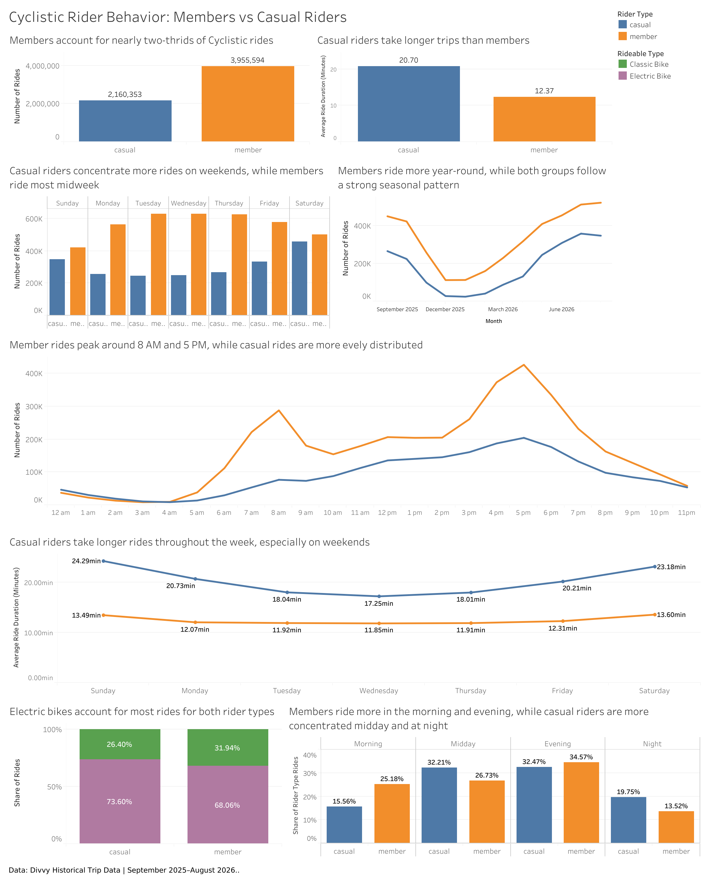

# Cyclistic Bike-Share Analysis

## Project Overview

This project analyzes 12 months of Divvy bike-share trip data to identify differences in riding behavior between casual riders and annual members.

The goal of the analysis is to provide data-driven recommendations that could help Cyclistic encourage casual riders to become annual members.

## Business Task

How do annual members and casual riders use Cyclistic bikes differently?

By identifying differences in riding patterns, Cyclistic can develop marketing strategies targeted toward converting casual riders into annual members.

## Tools Used

- PostgreSQL / DBeaver — data cleaning, transformation, and analysis
- Python — data inspection and validation
- Tableau — data visualization and dashboard creation
- Google Docs — final case study report

## Analysis Process

The project followed the Google Data Analytics process:

**Ask → Prepare → Process → Analyze → Share → Act**

## Data Source

The analysis used 12 months of historical Divvy bike-share trip data provided by the City of Chicago.

Each monthly dataset contained individual ride records with information such as:

- Ride ID
- Bike type
- Start and end timestamps
- Start and end station information
- Geographic coordinates
- Rider type: member or casual

Because the original datasets contain a very large number of records, the raw monthly CSV files are not included in this repository. Smaller summary datasets used for analysis and visualization are included instead.

## Data Preparation and Cleaning

The monthly datasets were inspected and cleaned before analysis.

The main preparation steps included:

- Reviewing table structure and column consistency
- Checking row counts and date ranges
- Identifying missing values
- Checking for duplicate ride IDs
- Investigating invalid or negative ride durations
- Standardizing fields and categories
- Combining the monthly datasets into one clean dataset
- Creating calculated variables such as ride duration
- Performing quality checks before analysis

## Analysis

After the data was cleaned and consolidated, SQL was used to compare the riding behavior of casual riders and annual members.

The analysis focused on several areas:

- Total number of rides
- Distribution of rides between casual riders and members
- Ride duration by rider type
- Monthly riding trends
- Day-of-week riding patterns
- Hour-of-day riding patterns
- Time-of-day usage
- Bike type usage
- Station activity

Aggregations and comparisons were used to identify differences in when, how often, and how long casual riders and annual members used the bike-share service.

The results of these queries were then used to create visualizations in Tableau and identify patterns relevant to the business question.

## Key Findings

The analysis revealed several clear differences between casual riders and annual members.

- **Annual members completed more total rides** than casual riders, suggesting that members use the service more consistently.

- **Casual riders generally had longer ride durations**, which may indicate that they are more likely to use Cyclistic for leisure or recreational trips.

- **Members showed stronger weekday usage**, while casual riders were more active on weekends.

- **Member activity was more concentrated around typical commuting hours**, while casual riders had a broader pattern of use throughout the day.

- **Ridership was higher during warmer months**, showing that seasonality has a strong effect on bike-share usage.

Overall, the patterns suggest that annual members are more likely to use Cyclistic as part of a regular transportation routine, while casual riders are more likely to use the service occasionally or recreationally.

## Tableau Dashboard

A Tableau dashboard was created to summarize the main differences between casual riders and annual members.

The dashboard includes visualizations for:

- Rider type distribution
- Ride duration
- Monthly ride trends
- Day-of-week patterns
- Hour-of-day patterns
- Bike type usage
- Station activity

These visualizations help make the differences between casual riders and annual members easier to understand and communicate.



**Tableau Public Dashboard:** [Cyclistic Rider Behavior: Members vs Casual Riders](https://public.tableau.com/views/CyclisticBike-ShareAnalysisMembersvsCasualRiders_17909345650780/CyclisticRiderBehavior?:language=en-US&:sid=&:redirect=auth&:display_count=n&:origin=viz_share_link)

## Recommendations

Based on the differences identified between casual riders and annual members, Cyclistic could consider the following actions:

### 1. Target Casual Riders During High-Activity Periods

Focus membership promotions during periods when casual ridership is highest, especially on weekends and during warmer months.

This would allow Cyclistic to reach casual riders when they are already actively using the service.

### 2. Promote Membership to Frequent Recreational Riders

Casual riders who take longer or repeated trips may be strong candidates for annual membership.

Marketing could emphasize the convenience and potential value of becoming a member for riders who use Cyclistic regularly.

### 3. Use High-Casual-Ridership Locations for Targeted Marketing

Cyclistic could focus promotions at stations and locations with high casual rider activity.

This could help the company reach recreational riders and tourists at points where they are already engaging with the bike-share system.

## Project Files

The repository is organized into separate folders for the main components of the project.

```text
cyclistic-bike-share-analysis/
│
├── README.md
│
├── SQL/
│   ├── 01_prepare_data_inspection.sql
│   ├── 02_prepare_data_quality.sql
│   ├── 03_process_data_cleaning.sql
│   └── 04_analyze_data.sql
│
├── Report/
│   └── Ivan_Sandoval_Cyclistic_Bike_Share_Case_Study.pdf
│
├── Visualizations/
│   ├── Cyclistic_Dashboard.png
│   ├── Rides_By_Month.png
│   ├── Rides_By_Day.png
│   ├── Rides_By_Hour.png
│   └── Ride_Duration.png
│
└── Data/
    ├── rider_type_summary.csv
    ├── ride_duration_summary.csv
    ├── rides_by_day.csv
    ├── rides_by_hour.csv
    └── rides_by_month.csv
``` 

## Final Report

The complete case study report includes the full analysis process, findings, visualizations, recommendations, and supporting documentation.

[View the Full Cyclistic Case Study Report](Report/Ivan_Sandoval_Cyclistic_Bike_Share_Case_Study.pdf)

## Skills Demonstrated

This project demonstrates experience with:

- SQL querying
- PostgreSQL
- Data cleaning
- Data validation
- Data transformation
- Exploratory data analysis
- Aggregate analysis
- Tableau dashboard development
- Data visualization
- Business problem solving
- Data storytelling
- Translating analytical findings into business recommendations
